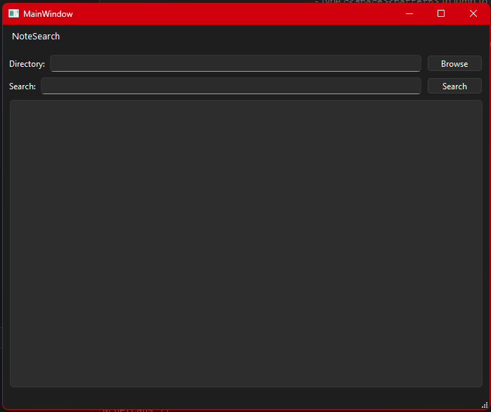
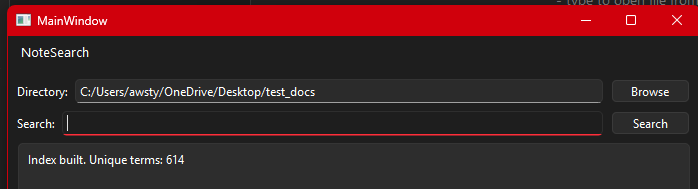
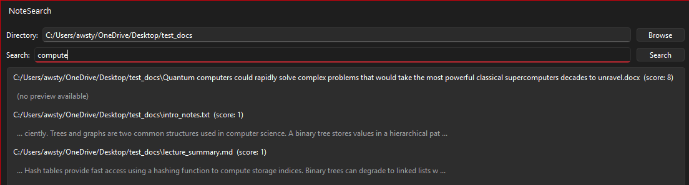

## Where We Left Off

At the end of Part 2, NoteSearch was a functioning desktop application capable
of indexing and searching through `.txt` and `.md` files. The backend was pure
C++, the Qt UI was a clean shell around it, and the two were deliberately kept
separate. The natural next step was extending the indexer to handle richer
document formats — starting with `.docx`.

## The Challenge with Word Documents

Word documents aren't a simple text format. A `.docx` file is actually a ZIP
archive containing a collection of XML files. The document content lives inside
`word/document.xml`, wrapped in a hierarchy of XML tags. To extract searchable
text, you have to unzip the archive, locate that file, parse the XML, and pull
out the text nodes — all before tokenization can even begin.

This required two external libraries: **miniz** for ZIP extraction and
**pugixml** for XML parsing. Both are pure C++ with no external dependencies,
which kept the backend clean and Qt-free.

## Keeping the Architecture Clean

The same separation principle from Part 2 applied here. The new `DocxParser`
lives entirely in the backend — it takes a file path, does its work, and returns
a plain `std::string` of extracted text. Qt never touches it. The `Indexer` 
calls it the same way it calls the plain text reader, and the result flows
through the same `tokenize()` pipeline as everything else.

From the `Indexer`'s perspective, a `.docx` file is just another source of
text. The file type handling is a single branch:

```cpp
if (ext == ".txt" || ext == ".md") {
    processFile(entry.path().string());
} else if (ext == ".docx") {
    processDocx(entry.path().string());
}
```

Everything downstream — tokenization, indexing, scoring, snippet extraction —
is completely unchanged.

## Integrating the Libraries

Getting miniz and pugixml into the project was more involved than expected.
Both libraries ship as multiple files rather than true single-header drops,
and the CMake configuration needed explicit source file declarations and
language properties to compile the C files correctly in a C++ project.
Downloading the full release packages rather than individual files resolved
most of the integration friction.

Once the libraries were correctly wired into CMakeLists.txt, the actual
`DocxParser` implementation was straightforward — open the ZIP, locate
`word/document.xml`, extract it into memory, parse the XML with pugixml,
walk the `<w:t>` nodes, and concatenate the text content.

## The Application

Here is the main NoteSearch window after indexing a directory containing
a mix of `.txt`, `.md`, and `.docx` files:




The interface is intentionally minimal consisting of a directory picker, a search bar,
and a results list. After selecting a folder the index builds immediately
and the result area confirms how many unique terms were found across all
supported file types.

Searching across a directory containing both plain text and Word documents
returns results from all file types together, ranked by relevance score:



Each result shows the file path, its relevance score, and a snippet preview
showing where the term appears in the document. The word count index
confirms the breadth of what was indexed.


## Reflection

The architectural decision to keep the backend Qt-free continued to pay
dividends here. Adding an entirely new file format required no changes to
the UI, no changes to the search logic, and no changes to the tokenizer.
The only new code was the parser itself and a single branch in the indexer.

The library integration was the roughest part of this phase. Working with
C libraries inside a C++ CMake project on Windows with MinGW introduced
several friction points around file discovery and compilation flags that
wouldn't have been issues on Linux. The lesson is to always download full
library releases rather than cherry-picking individual files from a
repository.

## What's Next

PDF support is the next planned extension, following the same pattern —
a pure C++ `PdfParser` in the backend, no Qt involvement, same tokenization
pipeline. Once both formats are supported the application will cover the
full range of personal note formats most people actually use.

## Repository

Full code: [https://github.com/AwstynC/NoteSearch](https://github.com/AwstynC/NoteSearch)
