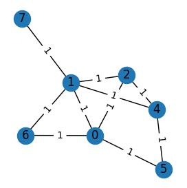
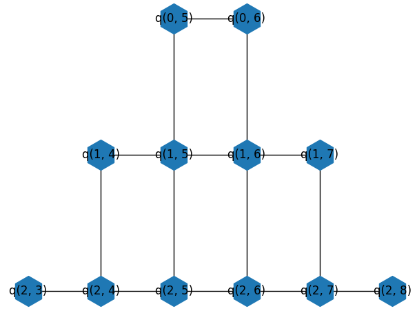

## What did I do last week?
Last week I finally implement a virtual environment for my project and went about properly installing the libraries that I am into that environment. They are also frozen to the specific versions they were downloaded as so as to prevent any breaks do to updates later on. I also studies further into Google's own cirq file regarding QAOA Maxcut and began running their implementation of this project to see what expected outputs should look like or would look like once my own implementation is complete. I've started with creating the graph and getting it to display properly, this has been a big frustration mainly due to initially using codespaces on github, giving up and cloning the repo onto my own hardware and that has been smoother sailing. My graph is on the left and the google graph is on the right. I have included line weights in my own graph as these will determine the number of cuts between each node. Google's implementation leaves out the weighting of the edges.

::: {#fig-graph-comparison layout-ncol=2}

{height=300px}

{height=300px}

Comparison of a randomly generated weighted graph and the Google Sycamore connectivity graph.
:::

## What are the next steps?
This week I plan to finish up the google example and begin the cut process for my own example and how that structure is going to work. Maybe finally I'll get a set schedule down as well.

## Are the any impediments in my way?
The only impediment in my way at the moment is a large scale maintenance project that I am in charge of this coming week that will the time I normally would use to complete other work and school tasks. I should be fine to work on the project while out in the field now that I have a clone of the project on my own device.

## Reflections
I tackled this initial step in a somewhat organized fashion by building the graph first, but I ended up making last minute changes to the display model that caused issues. Instead of going on impulse I'm going to figure out what steps to take next in the code first so that those changes are less likely to occur.