## Visualizing the Max-Cut Results

As part of the ongoing QAOA experiments, I have been generating cut 
visualizations across different graph sizes. For each graph, blue nodes 
are in partition 1 and red nodes are in partition 0. Green edges cross 
the partition boundary and contribute to the cut value. Gray edges 
connect nodes in the same partition and contribute nothing.

---

### n=8 — All Methods Find the Optimal Cut

At n=8 all three methods achieved an approximation ratio of 1.000, meaning 
every method found the same maximum cut of 38.43. This confirms the 
implementations are correct and agree on small graphs.

**Graph Structure (n=8)**

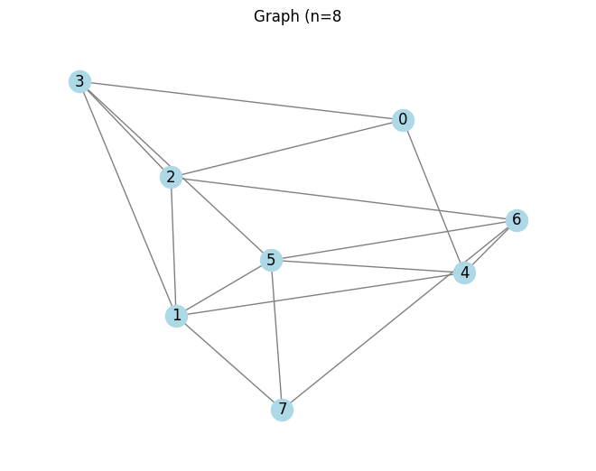

**Brute Force — Cut: 38.43 (ratio: 1.000)**

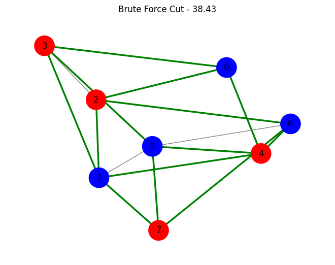

**Greedy — Cut: 38.43 (ratio: 1.000)**

**QAOA — Cut: 37.65 (ratio: 0.980)**

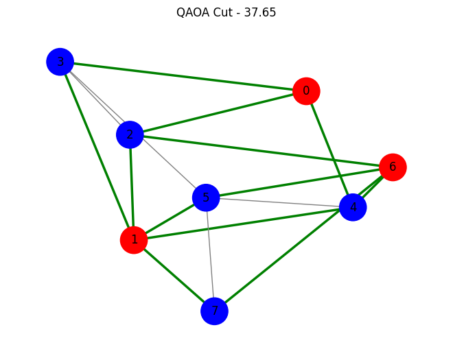

---

### n=10 — First Meaningful Divergence

At n=10 the methods begin to diverge noticeably. Greedy drops to a ratio 
of 0.839 while QAOA holds at 0.959. This is the first graph size where 
the choice of algorithm starts to meaningfully affect solution quality.

**Graph Structure (n=10)**

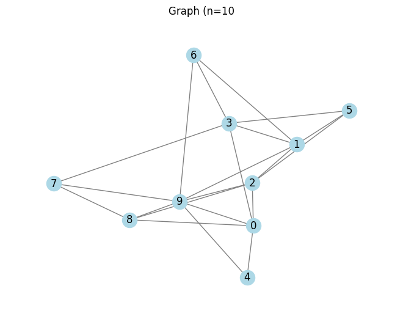

**Brute Force — Cut: 45.77 (ratio: 1.000)**

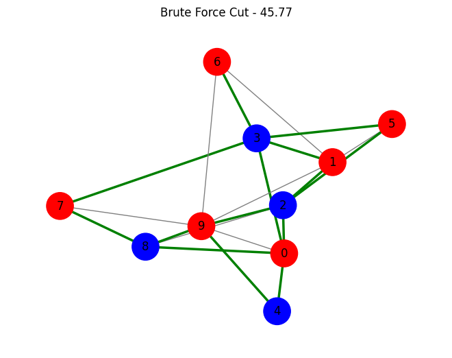

**Greedy — Cut: 38.40 (ratio: 0.839)**

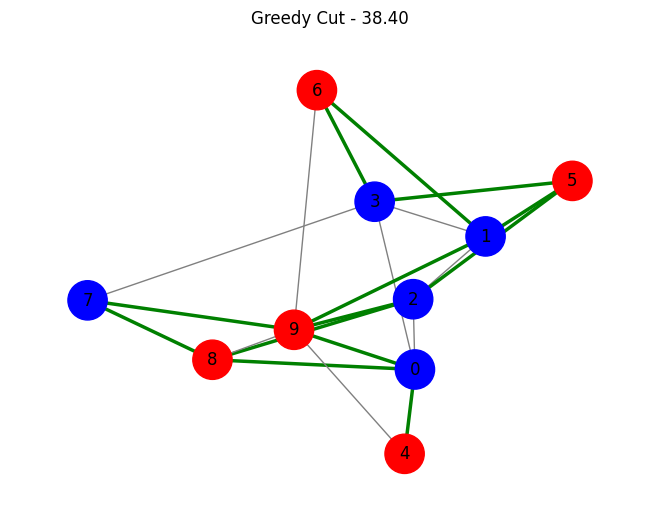

**QAOA — Cut: 43.90 (ratio: 0.959)**

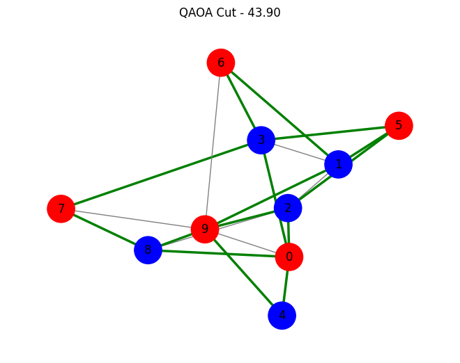

---

### n=30 — The Runtime Wall

At n=30 brute force took 118 minutes to find the optimal cut while QAOA 
simulation took approximately 103 minutes. Both methods are expensive at 
this scale when run classically. The graph is noticeably more complex and 
the partition boundaries are harder to visually interpret, which reflects 
the increased difficulty of the problem.

**Graph Structure (n=30)**

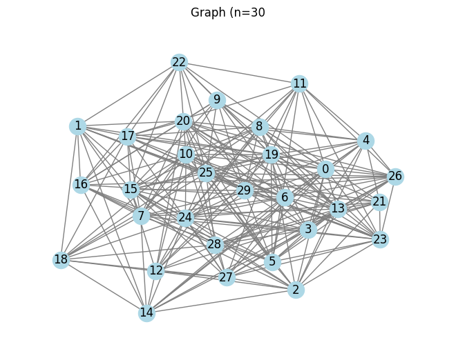

**Brute Force — Cut: 361.54 (ratio: 1.000)**

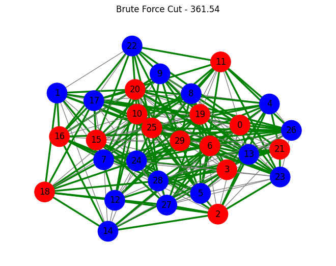

**Greedy — Cut: 303.28 (ratio: 0.839)**

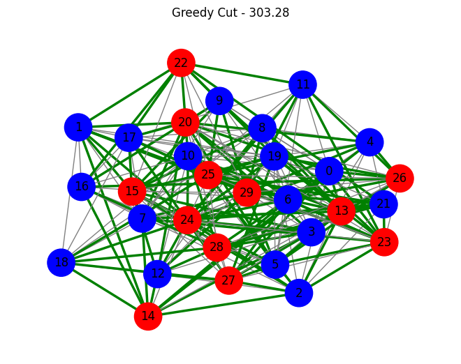

**QAOA — Cut: 310.21 (ratio: 0.858)**

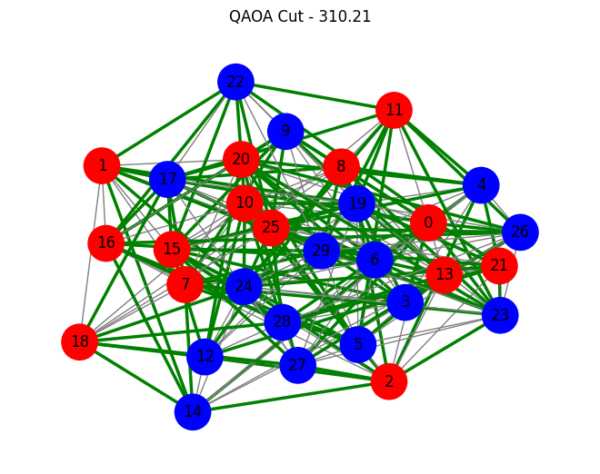

---

More analysis and final results coming in the project evaluation post.

**Repository:** [https://github.com/AwstynC/QAOA_MaxCut](https://github.com/AwstynC/QAOA_MaxCut)