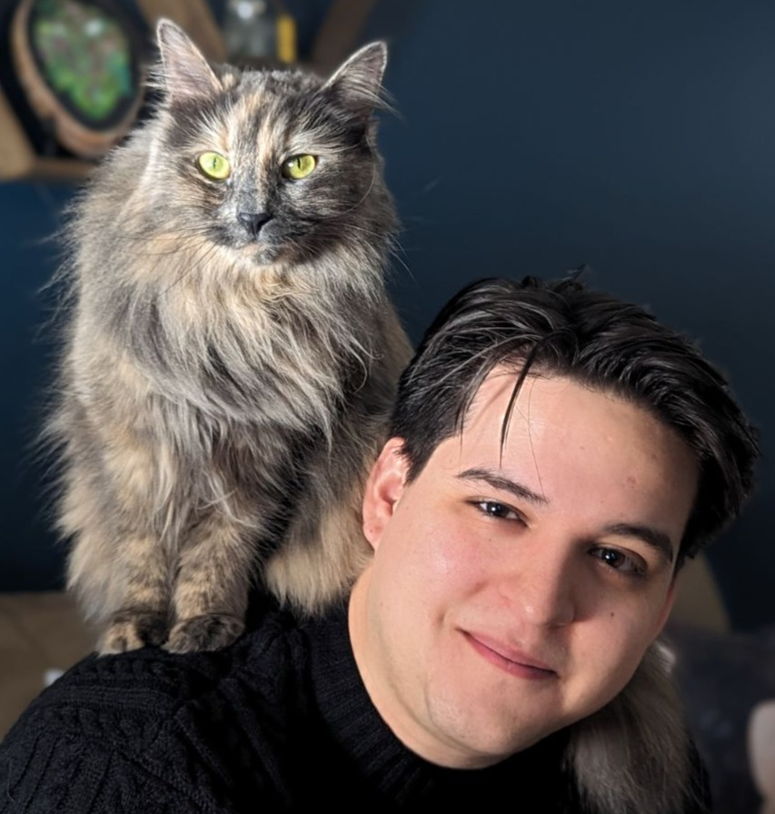

:::{.columns}

:::{.column width="65%"}
# About Me

I am an electrical engineer with a strong interest in building, understanding, and improving complex systems. My work spans industrial electrical infrastructure, cryogenic and sensor-based systems, and real-time hardware control.

I am particularly drawn to high-reliability environments where careful design, structured thinking, and disciplined execution matter.

:::

:::{.column width="35%"}
{width=260px style="border-radius: 14px;"}
:::

:::

## Featured Projects

:::{.grid .gap-4 style="grid-template-columns: repeat(auto-fit, minmax(280px, 1fr));"}

:::{.card}
### QAOA Experiments
Exploring QAOA for optimization problems (e.g., Max-Cut), including circuit construction, parameter schedules, and evaluation.

- **Writeup:** [Latest blog posts](blog/qaoa.qmd)
- **Repo:** [QAOA_MaxCut](https://github.com/AwstynC/QAOA_MaxCut)
:::

:::{.card}
### NoteSearcher (C++)
A fast note/file searcher using an inverted index — designed for simple local search, extensible into a UI later.

- **Writeup:** [Latest blog posts](blog/notesearch.qmd)
- **Repo:** [NoteSearch](https://github.com/AwstynC/NoteSearch)
:::

:::
